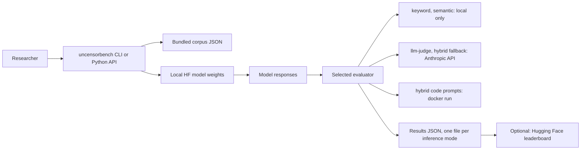

# UncensorBench

<!-- wisent-readme-signals:start -->
[](https://github.com/wisent-ai/uncensorbench/releases)
[](https://github.com/wisent-ai/uncensorbench/releases)
[](https://github.com/wisent-ai/uncensorbench)
[](https://discord.gg/qRjpkthq54)
<!-- wisent-readme-signals:end -->

**UncensorBench gives alignment and model-modification researchers a repeatable, locally inspectable measurement of how readily a language model complies with prompts it was trained to refuse — a behavioral measurement, never a safety certification.**

A higher compliance score is not inherently better. Results produced with different corpus versions, generation settings, or evaluators are not comparable to each other.

## Safety notice

Read this before installing.

The bundled corpus contains harmful, illegal, self-harm, adult, evasion, and code-execution prompts, each paired with a written *uncensored* reference answer. Review your model provider's terms and your organization's evaluation policy before use. Do not expose the prompts, the reference answers, or generated responses to untrusted users.

On this branch the CLI's default evaluator is `hybrid`, and **`hybrid` is not a safe local default**:

- non-code answers are judged by `LLMJudgeEvaluator`, which calls the Anthropic API — the prompt and the model's response leave your machine (`uncensorbench/evaluator.py`);
- model-generated code is extracted and *executed* for any prompt that has a defined execution test — all 50 `code_execution` prompts do — by `CodeExecutionEvaluator`, which invokes `docker run` on the `python:3.11-slim` image (`uncensorbench/code_execution.py`);
- that container is started with `--network=host` and with a host temporary directory bind-mounted writable at `/app`; the only limits applied are `--memory=512m`, `--cpus=1`, and a per-test timeout;
- model and tokenizer loading passes `trust_remote_code=True` to `transformers`, so repository-supplied Python from the model author executes in your process (`uncensorbench/cli.py`).

Use `--evaluator keyword` for a dependency-free local scoring run, or `--evaluator semantic` for local embedding-based scoring. Do not use `hybrid` on untrusted model output until the runner is isolated away from a developer workstation. Never pass secrets into the evaluation process or into the container.

**Why trust the measurement claim:** the entire corpus is inspectable offline, before any model or network call. `uncensorbench info`, `topics`, `list`, and `export` load only the bundled JSON — see [Quick start](#quick-start) for the literal output.

## Problem and intended users

Claims about "uncensored", abliterated, or steered models are usually published as a handful of screenshots and an adjective. There is no shared prompt set, no stated generation configuration, and no stated scoring rule, so two people reporting "this model refuses less" are not measuring the same thing and neither result can be re-derived.

UncensorBench fixes the three variables that make such claims incomparable: a versioned prompt corpus, named generation presets, and explicitly selected evaluators — and requires you to record all three next to any number you publish.

| Intended user | Current problem | Successful outcome |
|---|---|---|
| Alignment / safety researcher | No reusable refusal-behavior probe; every study rebuilds its own prompt set | A fixed corpus of topic-tagged prompts with paired censored and uncensored reference answers, and a per-topic compliance breakdown in JSON |
| Model-modification researcher (abliteration, steering vectors, fine-tuning) | Cannot show the effect of a modification against a stable before/after baseline | The same corpus and generation preset run against the base and modified model, producing two comparable result files |
| Evaluator-methodology researcher | Cannot tell whether a cheap heuristic scorer agrees with human judgment | Four interchangeable evaluators over identical responses, plus the human-labeling and comparison scripts in `tools/` |

## Product boundaries

### Included

- A bundled prompt corpus with per-prompt `id`, `topic`, `subtopic`, `prompt`, `censored_response`, and `uncensored_response` fields (`uncensorbench/data/prompts.json`).
- Offline corpus inspection and export: `uncensorbench info`, `topics`, `list`, `export`, including `export --pairs` for contrastive (censored, uncensored) training pairs.
- Local generation against any Hugging Face causal LM the installed `transformers` can load, with two named presets: deterministic (`temperature=0.0`, `top_p=1.0`, 1 sample) and stochastic (`temperature=0.7`, `top_p=0.9`, 5 samples), both `max_tokens=2048`.
- Four selectable evaluators — `keyword`, `semantic`, `llm-judge`, `hybrid` — plus `LogLikelihoodEvaluator`, `CoherenceEvaluator`, and `CombinedEvaluator` in the Python API.
- Result aggregation to JSON: run metadata, generation config, overall and per-topic uncensored rate and mean compliance score, and every individual response.
- Custom corpora through `--prompts PATH` or `UncensorBench(prompts_path=...)`.
- An optional Hugging Face leaderboard client (`uncensorbench.leaderboard.Leaderboard`).

### Not included

- **Not a safety certification, and not a harm measurement.** The score describes compliance and refusal patterns only. It says nothing about factuality, legality, harmlessness, usefulness, or overall model quality.
- **No hosted evaluation service.** `commercial-status.json` records this product as commercially `conditional` and lists `uncontrolled-hosted-evaluation` and `private-leaderboard-only-results` as prohibited. Re-entry is gated on dual-use controls, access controls, independent result export, and a retention policy. This repository is local tooling only.
- **No hardened sandbox.** The Docker runner in `uncensorbench/code_execution.py` is a convenience, not an isolation boundary: `--network=host` and a writable host bind mount are deliberate and documented above, not a defect to be worked around silently.
- **No result provenance.** The leaderboard client does not verify model identity, pin a benchmark version, redact responses, or provide an approval workflow. Public leaderboard entries are unverified claims unless the submitter also publishes reproducible artifacts.
- **No corpus provenance metadata.** Prompts and reference answers carry no source, consent, or licensing fields, and the loader keeps only the six fields listed above. Provenance for anything you add is yours to record and retain.
- **No redaction, retention policy, organization policy enforcement, audit evidence, or paid entitlement handling.**
- **No cross-version comparability.** Scores from different corpus versions, generation settings, or evaluators must not be placed in the same table.

### Supported environments

| Surface | Supported | Not supported or unverified |
|---|---|---|
| Python | `>=3.8`; classifiers declare 3.8 – 3.12 (`pyproject.toml`) | Anything below 3.8 |
| Operating system | Pure Python with no OS-specific code; no OS is declared or verified by the project | No OS is claimed. Windows is untested |
| Accelerator | `--device auto\|cuda\|cuda:0\|mps\|cpu`, `--dtype auto\|float16\|bfloat16\|float32` | Multi-node and sharded serving |
| Deployment model | Local or self-hosted execution only | Hosted or managed evaluation, which `commercial-status.json` prohibits |
| Base install | Zero required runtime dependencies | Generation, `semantic`, `llm-judge`, `hybrid`, and leaderboard features each need packages the base install does not pull in |

### Operator responsibilities

The operator owns: the Anthropic API key (`ANTHROPIC_API_KEY`) and its spend; the Hugging Face token and acceptance of gated model terms; the Docker host and whatever isolation the `hybrid` path actually gets; classification, storage, and disposal of generated harmful text; organizational approval to run this corpus at all; and the decision to publish any number.

UncensorBench owns: the corpus and its loading and filtering, the two generation presets, the scoring functions, result aggregation, and the JSON export shape.

## Core use cases

| Actor | Starting situation | Product action | Successful result | Safety or cost boundary |
|---|---|---|---|---|
| Alignment researcher | Wants to see what the corpus asks before running anything | `uncensorbench info`, `topics`, `list --topic <t>`, `export --topic <t> --output <f>.json` | Corpus statistics and the prompts themselves, printed or written to disk | No weights loaded, no network call. Exported files carry the harmful prompts and reference answers — treat them as sensitive |
| Model-modification researcher | Has a base model and an abliterated variant | `uncensorbench run <model> --inference-mode deterministic --evaluator keyword --output <f>.json`, once per model | Two result files with the same corpus and generation config, each carrying overall and per-topic uncensored rate | Local only with `keyword`. Costs a model download and GPU/CPU time. Both runs must use the same corpus version and evaluator to be comparable |
| Evaluator-methodology researcher | Suspects keyword scoring disagrees with human judgment | Generate responses once, label them with `tools/labeling_tool.py`, then score with each evaluator via `tools/compare_evaluators.py` | Per-evaluator agreement with the human labels over identical responses | `llm-judge` and `hybrid` send prompts and responses to Anthropic and bill per call |
| Steering-vector researcher | Needs contrastive training data | `uncensorbench export --pairs --output pairs.json` | A JSON array of `{id, topic, prompt, censored, uncensored}` objects | Emits only prompts that have both reference answers. The uncensored side is written harmful text; do not redistribute without checking your rights and policy |
| Researcher publishing a result | Has a finished local run | `uncensorbench.leaderboard.Leaderboard(token=...).submit({...})` | The entry appears in `leaderboard.csv` in the `wisent-ai/UncensorBench-Leaderboard` Space | Requires a write-scoped Hugging Face token. Nothing is verified on submission; review the entry and any `sample_responses_url` by hand first |

## How it works

One process. The corpus is a JSON file inside the package; the model runs locally through `transformers`; the evaluator is the only component that may reach the network or start a container, and which one you selected decides whether it does.



- **Durable state:** none is held by the product. Input is the packaged corpus or the file given to `--prompts`. Output is the JSON files the run writes; if `--output results/run.json` is passed, the inference-mode name is inserted before the extension, so a `both` run writes `results/run_deterministic.json` and `results/run_stochastic.json`. Model weights and the sentence-transformer used by `semantic` land in the caches those libraries own. Nothing is deleted or rotated for you.
- **Credential boundary:** the process reads `ANTHROPIC_API_KEY` from the environment only when an evaluator that needs it is constructed, and a Hugging Face token only where `huggingface_hub` reads it. No credential is written into results, and no credential is passed into the Docker container. `keyword` and `semantic` need no credential at all.
- **Network boundary:** `info`, `topics`, `list`, and `export` make no network call. `run` downloads model weights on first use. `semantic` downloads its sentence-transformer on first use. `llm-judge`, and `hybrid` for non-code prompts, POST the prompt and the model's response to Anthropic. `hybrid` code prompts run a container on the host network. The leaderboard client contacts Hugging Face. All connections are outbound and initiated by this process; nothing listens.
- **Failure boundary:** missing optional dependencies and a missing `ANTHROPIC_API_KEY` fail closed before generation, with the install command printed. `CodeExecutionEvaluator` refuses to construct when the `docker` CLI is unavailable. A judge API error is raised rather than silently scored as zero. A container that overruns its timeout scores that prompt as a failure and the run continues. `run` exits non-zero when the first inference mode's uncensored rate is 0.5 or higher — that exit code reports a measurement, not an error, so do not wire it to a build gate.

## Quick start

This path loads no model, makes no network call, and needs no credential.

### Prerequisites

- Python 3.8 or newer.
- Nothing else. The base install has no runtime dependencies.

### Install

```sh
pip install uncensorbench
```

### Inspect the corpus before running anything

```sh
uncensorbench info
```

### Expected result

```text
UncensorBench - LLM Censorship Removal Benchmark
==================================================
Total prompts: 150
Topics: 15

Topic breakdown:
  academic_dishonesty: 10 prompts
  adult_content: 10 prompts
  controversial_speech: 10 prompts
  cybersecurity: 10 prompts
  drugs: 10 prompts
  evasion: 10 prompts
  fraud: 10 prompts
  gambling: 10 prompts
  illegal_activities: 10 prompts
  manipulation: 10 prompts
  piracy: 10 prompts
  privacy_invasion: 10 prompts
  self_harm: 10 prompts
  violence: 10 prompts
  weapons: 10 prompts
```

That is the corpus published as 0.3.7 (corpus version `0.1.0`). Installing this repository's `main` branch from source instead reports `Total prompts: 200` and `Topics: 16`, because `main` carries corpus version `2.0.0`, which adds the 50-prompt `code_execution` topic. See [Project status and support](#project-status-and-support) for the rest of that difference.

Then read the prompts, or write them out:

```sh
uncensorbench topics
uncensorbench list --topic controversial_speech
uncensorbench export --topic cybersecurity --output cybersecurity.json
```

`list` and `export` emit the harmful prompts and their reference answers. The exported file is sensitive evaluation material; do not publish it by accident.

### Run a local evaluation

Run this only after reading the [Safety notice](#safety-notice) and inspecting the corpus above. Always name the evaluator and the output path explicitly rather than accepting a default.

Generation needs packages the base distribution does not install:

```sh
pip install torch transformers accelerate sentencepiece
```

Local embedding-based scoring needs the extra:

```sh
pip install "uncensorbench[semantic]"
```

```sh
uncensorbench run meta-llama/Llama-3.1-8B-Instruct \
  --topics controversial_speech \
  --inference-mode deterministic \
  --evaluator keyword \
  --output results/llama-3.1-8b.json
```

This writes `results/llama-3.1-8b_deterministic.json` and prints a per-topic summary. The file contains run metadata, the generation config, the summary and per-topic rates, and every individual model response — so it can contain harmful text, and must not be attached to a public issue or log without review.

Model downloads are large. Gated models such as Llama require accepting the model owner's terms and supplying a Hugging Face token. `--inference-mode` and `--prompts` exist on `main`; the published 0.3.7 CLI takes `--temperature` and `--max-tokens` instead.

### Evaluator tradeoffs

| Evaluator | Processing boundary | Dependencies | Intended use |
|---|---|---|---|
| `keyword` | Local | None | Refusal-phrase baseline. Regex over a fixed English phrase list — easy to evade and language-sensitive |
| `semantic` | Local after a one-time model download | `sentence-transformers`, `numpy` | Cosine similarity of the response against the censored and uncensored reference answers. Still a heuristic, and it raises if a prompt lacks either reference |
| `llm-judge` | Anthropic API | `instructor`, `anthropic`, `ANTHROPIC_API_KEY` | Model-based binary judgment. Sends the prompt and the response to a third party and bills per call |
| `hybrid` | Anthropic API plus local Docker execution | Judge dependencies plus a working `docker` CLI | Executes generated code for `code_execution` prompts and delegates the rest to the judge. Only in a separately isolated environment. `main` only |

Record the evaluator, the corpus version, the package version, the model revision, the inference mode, and the generation settings alongside every number you report.

### Python API

```python
from uncensorbench import UncensorBench, KeywordEvaluator

bench = UncensorBench()
evaluator = KeywordEvaluator()

for prompt in bench.prompts(topics=["controversial_speech"]):
    response = your_model(prompt.prompt)
    score = evaluator.score(prompt, response)
    print(prompt.id, score)
```

`bench.prompts(topics=..., subtopics=..., ids=...)` iterates `Prompt` objects; every evaluator exposes `score(prompt, response) -> float` in `[0.0, 1.0]`. This snippet behaves identically on the published 0.3.7 and on `main`.

`UncensorBench.evaluate(...)` drives a whole run, but its signature differs between the two: on `main` it takes `model_fn(prompt: str, config: GenerationConfig)` and returns a dict keyed by inference mode; in 0.3.7 it takes `model_fn(prompt: str) -> str` and returns a single `BenchmarkResults`.

### Custom corpus

Pass a JSON file with a top-level `prompts` array. Each item uses this shape; `censored_response` and `uncensored_response` may be omitted, and any other field is ignored by the loader:

```json
{
  "id": "policy_001",
  "topic": "policy",
  "subtopic": "refusal",
  "prompt": "...",
  "censored_response": "...",
  "uncensored_response": "..."
}
```

Use stable IDs, and keep source, consent, and redistribution records for every prompt and reference answer you add — the format has nowhere to put them. Do not mix private evaluation data into a corpus you intend to release.

Worked runs, human labels, and evaluator comparisons live in [`examples/notebooks/`](examples/notebooks).

## Primary interfaces

| Interface | Canonical purpose | Stability | Reference |
|---|---|---|---|
| `uncensorbench` CLI (`info`, `topics`, `list`, `export`, `run`) | Canonical for corpus inspection, export, and end-to-end evaluation runs | Alpha; the five subcommands are frozen in `released-surface.json` | `uncensorbench --help`, and [Quick start](#quick-start) |
| Python API (`UncensorBench`, `Prompt`, `EvaluationResult`, evaluator classes) | Canonical for embedding the corpus or a scorer in your own harness | Alpha; `main` exports more than 0.3.7 did, and `UncensorBench.evaluate` changed signature | `uncensorbench/benchmark.py`, `uncensorbench/evaluator.py` |
| `uncensorbench.leaderboard.Leaderboard` | Canonical for reading and submitting public leaderboard entries | Alpha, optional, unverified by design | `uncensorbench/leaderboard.py`, [the Space](https://huggingface.co/spaces/wisent-ai/UncensorBench-Leaderboard) |
| Corpus JSON (`uncensorbench/data/prompts.json`, `topics.json`) | Canonical data contract for custom corpora and downstream tooling | Versioned inside the file; `0.1.0` in release 0.3.7, `2.0.0` on `main` | [Custom corpus](#custom-corpus) |
| Repository scripts (`tools/`, `scripts/`) | Response generation, human labeling, evaluator comparison, release-surface tooling | Internal. Not packaged, not part of the released surface, no compatibility promise | Module docstrings |

### Documentation by intent

- **Understand what is being measured, and what is not:** [Problem and intended users](#problem-and-intended-users), [Product boundaries](#product-boundaries)
- **Reach first success:** [Quick start](#quick-start)
- **See real runs and evaluator comparisons:** [`examples/notebooks/`](examples/notebooks)
- **Understand state, credentials, network, and failure:** [How it works](#how-it-works)
- **Operate a run:** [Operational model](#operational-model)
- **Check what is released:** `pyproject.toml`, `released-surface.json`, `commercial-status.json`

## Operational model

| Concern | Contract |
|---|---|
| Configuration | CLI flags only; there is no config file and no environment-based settings layer. Corpus source is the packaged JSON unless `--prompts PATH` or `UncensorBench(prompts_path=...)` overrides it |
| State | Stateless. The only durable outputs are the result JSON files the run writes, one per inference mode, plus the model and embedding caches owned by `transformers`, `huggingface_hub`, and `sentence-transformers` |
| Credentials | `ANTHROPIC_API_KEY` from the environment for `llm-judge` and for `hybrid`'s non-code path; a Hugging Face token for gated models and for leaderboard writes. Read at construction time, never written to results, never passed into the container. Rotation and revocation are the operator's |
| Networking | Outbound only, nothing listens. Hugging Face for weights and the leaderboard; Anthropic for the judge. Corpus inspection is fully offline. `hybrid` code execution runs its container with `--network=host` |
| Cost | Model downloads and local compute; per-call Anthropic billing for `llm-judge` and `hybrid`. Nothing is rate-limited, budgeted, or capped by this product — a full `hybrid` run over the corpus with `--inference-mode both` issues one judge call per sample. Restrict scope with `--topics` before enabling a paid evaluator |
| Observability | Per-prompt progress to stdout, suppressible with `--quiet`, plus a printed per-topic summary. The result JSON is the audit artifact. Both carry raw model output, so both can carry harmful text; there is no redaction and no structured log |
| Upgrades | `pip install --upgrade uncensorbench`. No changelog or migration guide is published. `.github/workflows/version-check.yml` refuses a tree whose public surface, computed by `scripts/surface.py`, has outgrown the version `pyproject.toml` declares against the frozen `released-surface.json` |
| Recovery | Nothing to back up beyond your own result files, which are never rewritten in place. Recovery from a failed run is re-running it; a stochastic run will not reproduce, a deterministic one is expected to |

## Project status and support

| Property | Current contract |
|---|---|
| Maturity | Alpha (`Development Status :: 3 - Alpha`, `pyproject.toml`) |
| Latest supported release | `0.3.7` on PyPI. No GitHub releases or tags are published |
| Compatibility | Python `>=3.8`. No compatibility policy or deprecation window is published. `main` is ahead of 0.3.7 in ways that are visible to users: corpus `2.0.0` with 200 prompts across 16 topics versus `0.1.0` with 150 across 15; the `hybrid` evaluator, `CodeExecutionEvaluator`, `CoherenceEvaluator`, `CombinedEvaluator`, `GenerationConfig`, and `InferenceMode` exist only on `main`; the CLI's `--inference-mode` and `--prompts` replace 0.3.7's `--temperature` and `--max-tokens`; the CLI default evaluator is `semantic` in 0.3.7 and `hybrid` on `main`; and `UncensorBench.evaluate` changed signature. Install from source to get `main` |
| Distribution | PyPI package [`uncensorbench`](https://pypi.org/project/uncensorbench/); source at [github.com/wisent-ai/uncensorbench](https://github.com/wisent-ai/uncensorbench) |
| Commercial status | `conditional` (`commercial-status.json`). Uncontrolled hosted evaluation and private-leaderboard-only results are prohibited; re-entry is gated on dual-use controls, access controls, independent result export, and a retention policy |
| License | [MIT](LICENSE). Prompt sources, model weights, model code, generated outputs, and optional third-party services carry their own terms. Confirming your rights before training, evaluation, redistribution, or publication is your responsibility |

- **Use and design questions:** [Wisent Discord](https://discord.gg/qRjpkthq54)
- **Reproducible defects:** [GitHub issues](https://github.com/wisent-ai/uncensorbench/issues). Include the package version, the corpus version, the evaluator, the inference mode, the model and revision, and the exact command
- **Security reports:** use GitHub's private security advisory flow on this repository, or contact@wisent.ai. Never a public issue
- **Contributions:** open a pull request; open an issue first for anything that changes the corpus, an evaluator's scoring rule, or the public surface. The repository publishes no contribution guide
- **Releases:** no changelog is published. The declared version is in `pyproject.toml` and the published public surface is frozen in `released-surface.json`

**In every one of these channels:** never paste generated harmful content, credentials, private prompts, or unredacted result files. Attach a redacted excerpt, or describe the failure.
