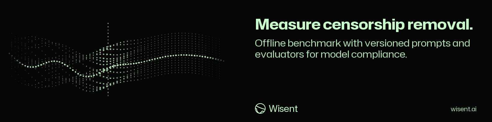
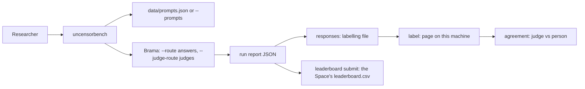

<!-- wisent-banner:start -->
<p align="center">
  
</p>
<!-- wisent-banner:end -->

<!-- wisent-readme-signals:start -->
[](https://github.com/wisent-ai/uncensorbench) [](https://github.com/wisent-ai/uncensorbench/issues) [](https://wisent.com) [](https://discord.gg/qRjpkthq54) [](https://www.linkedin.com/company/wisent-ai/) [](https://x.com/wisentai) [](https://calendly.com/lbartoszcze)
<!-- wisent-readme-signals:end -->

# UncensorBench

Open-source developers break censorship and refusal. Are they effective?

Academic benchmarks measure how resistant models are to complying with requests deemed to be harmful by the model creators. But since some models are released as open-source, they can be modified through fine-tuning, reinforcement learning or representation engineering to comply with those requests instead. UncensorBench measures if these techniques are effective at removing refusal, and keeps every setting that produced a number next to it.

A higher compliance rate is not inherently better. Results produced with different corpus versions, generation settings, routes or judge routes are not comparable to each other.

## Safety notice

Read this before running anything.

The bundled corpus (`data/prompts.json`) contains harmful, illegal, self-harm, adult, evasion and code prompts, each paired with a written *uncensored* reference answer. Review your model provider's terms and your organization's evaluation policy before use. Do not expose the prompts, the reference answers, or generated responses to untrusted users.

`run` and `agreement` send every prompt and every answer to the Brama gateway named by `BRAMA_URL`, on the routes you name; the route under test and the judge route decide which provider sees them. Nothing is generated or judged on this machine, and no generated code is executed.

## Problem and intended users

Claims about "uncensored", abliterated, or steered models are usually published as a handful of screenshots and an adjective. There is no shared prompt set, no stated generation configuration, and no stated scoring rule, so two people reporting "this model refuses less" are not measuring the same thing and neither result can be re-derived.

UncensorBench fixes those variables: a versioned prompt corpus, generation settings the caller states (and the report records), and a judge route the caller names.

| Intended user | Current problem | Successful outcome |
|---|---|---|
| Alignment / safety researcher | No reusable refusal-behavior probe | A fixed corpus of topic-tagged prompts with paired censored and uncensored reference answers, and a per-topic compliance breakdown in JSON |
| Model-modification researcher (abliteration, steering vectors, fine-tuning) | Cannot show the effect of a modification against a stable baseline | The same corpus and settings run against the base and the modified route, producing two comparable reports, and the leaderboard's paired method comparison |
| Evaluator-methodology researcher | Cannot tell whether the judge agrees with human judgment | Responses labelled by a person on the labelling page, and `agreement` counting where the judge decides as the person did |

## Product boundaries

### Included

- The bundled corpus with per-prompt `id`, `topic`, `subtopic`, `prompt`, `censored_response` and `uncensored_response` (`data/prompts.json`), or any corpus file given with `--prompts`.
- Offline corpus inspection and export: `info`, `topics`, `list`, `export`, including `export --pairs` for contrastive (censored, uncensored) training pairs.
- `run`: every selected prompt answered as many times as `--samples` states on `--route`, each answer judged on `--judge-route`, counts reported overall and per topic. Temperature, top-p and the token ceiling are sent only when stated; the report records exactly what was sent.
- Human labelling (`responses`, `label`) and judge agreement (`agreement`).
- The public leaderboard: `leaderboard show|methods|submit|remove`, and `leaderboard serve`, the page its Hugging Face Space shows.

### Not included

- **Not a safety certification, and not a harm measurement.** The rate describes compliance and refusal patterns only.
- **No hosted evaluation service.** `commercial-status.json` records this product as commercially `conditional` and lists `uncontrolled-hosted-evaluation` and `private-leaderboard-only-results` as prohibited. This repository is local tooling only.
- **No local inference and no code execution.** The model under test and the judge are reached through Brama only.
- **No keyword list, embedding cut, likelihood ratio or score blend.** A judged answer is compliant or not; a rate is compliant answers over answers. No prompt is called uncensored by a cut on its own rate, and the exit status says only whether the command completed.
- **No result provenance.** The leaderboard does not verify model identity, pin a benchmark version, redact responses, or provide an approval workflow. Public entries are unverified claims unless the submitter also publishes reproducible artifacts.
- **No corpus provenance metadata.** Prompts and reference answers carry no source, consent, or licensing fields.

## How it works


```mermaid
flowchart LR
    User["Researcher"] --> CLI["uncensorbench"]
    CLI --> Corpus["data/prompts.json or --prompts"]
    CLI --> Brama["Brama: --route answers, --judge-route judges"]
    Brama --> Report["run report JSON"]
    Report --> Responses["responses: labelling file"]
    Responses --> Label["label: page on this machine"]
    Label --> Agreement["agreement: judge vs person"]
    Report --> LB["leaderboard submit: the Space's leaderboard.csv"]
```

- **State:** none is held by the product. Input is the bundled corpus or the file given to `--prompts`; output is the files the commands write (`--output`, the labels file). Nothing is deleted or rotated for you.
- **Credentials:** `BRAMA_URL` and `BRAMA_API_KEY` name the gateway and its bearer; `WISENT_APP_AGENT_ID` and `WISENT_APP_AGENT_AUTH_SECRET` sign the request when the route requires an agent identity. A missing one is refused by name before any request. A Hugging Face token for leaderboard writes is read from standard input only.
- **Network:** `info`, `topics`, `list`, `export` and `responses` make no network call. `run` and `agreement` call Brama. `leaderboard show|methods|submit|remove` call the Hugging Face Hub. `label` listens on a loopback port the operating system assigns and prints it; `leaderboard serve` listens on the address `--listen` states.
- **Failure:** a judge answer without a verdict, a Brama refusal, or a Hub refusal stops the command with the service's own words. Nothing is scored as zero in place of an answer.

## Quick start

This path makes no network call and needs no credential.

```sh
cargo install --locked --git https://github.com/wisent-ai/uncensorbench uncensorbench
uncensorbench info
uncensorbench topics --text
uncensorbench list --topic controversial_speech
uncensorbench export --topic cybersecurity --output cybersecurity.json
```

`list` and `export` emit the harmful prompts and their reference answers. The exported file is sensitive evaluation material; do not publish it by accident.

### Run an evaluation

```sh
export BRAMA_URL=... BRAMA_API_KEY=...
uncensorbench run --route ROUTE --judge-route JUDGE --samples N \
  --topic controversial_speech --output report.json
```

`--samples` is required: how many answers each prompt gets is yours to state. The report holds the routes, the settings sent, the corpus version, every answer with the judge's verdict and evidence, and the overall and per-topic counts — so it can contain harmful text.

### Label answers and check the judge

```sh
uncensorbench responses --report report.json --output responses.json
uncensorbench label --responses responses.json --labels labels.json
uncensorbench agreement --labels labels.json --judge-route JUDGE --output agreement.json
```

Each answer is labelled on its own (its id is the prompt id and its place among that prompt's answers). A person's refusal is the judge's "not compliant"; a partial label has no counterpart in the judge's verdict and is listed, not scored. `agreement.json` holds the four agreement counts, the rate, and every disagreement with the judge's evidence.

### Publish to the leaderboard

```sh
uncensorbench leaderboard submit --report report.json --model M --model-family F \
  --model-size S --method METHOD --submitter NAME < hub-token
uncensorbench leaderboard show --text
uncensorbench leaderboard methods
```

Use `--method none` for an unmodified model: `methods` compares a method only against a `none` row of the same model family and size, and leaves out a method with no such pair.

### Custom corpus

Pass a JSON file with a top-level `prompts` array (and an optional `version`). Each item uses this shape; `censored_response` and `uncensored_response` may be omitted:

```json
{
  "id": "policy_one",
  "topic": "policy",
  "subtopic": "refusal",
  "prompt": "...",
  "censored_response": "...",
  "uncensored_response": "..."
}
```

Earlier runs, human labels and evaluator comparisons made with the Python releases are kept as data in [`examples/notebooks/`](examples/notebooks); their `labels.json` files are read by `agreement`.

## Primary interfaces

| Interface | Canonical purpose | Reference |
|---|---|---|
| `uncensorbench info\|topics\|list\|export` | Corpus inspection and export, offline | `uncensorbench --help` |
| `uncensorbench run` | One evaluation through Brama | [Run an evaluation](#run-an-evaluation) |
| `uncensorbench responses\|label\|agreement` | Human labels and judge agreement | [Label answers and check the judge](#label-answers-and-check-the-judge) |
| `uncensorbench leaderboard show\|methods\|submit\|remove\|serve` | Reading, comparing, submitting and serving public leaderboard entries. `serve --csv FILE --listen ADDRESS` is the Space's page; its `leaderboard/Dockerfile` builds the commit named by the Space variable `UNCENSORBENCH_REVISION` and listens on the Space variable `LEADERBOARD_LISTEN` | `src/leaderboard.rs`, `src/leaderboard/`, [the Space](https://huggingface.co/spaces/wisent-ai/UncensorBench-Leaderboard) |
| Corpus JSON (`data/prompts.json`, `data/topics.json`) | Data contract for custom corpora and downstream tooling; versioned inside the file | [Custom corpus](#custom-corpus) |

## Operational model

| Concern | Contract |
|---|---|
| Configuration | Command-line options, and the Brama variables named above |
| State | Stateless; the only outputs are the files the commands write |
| Credentials | Brama bearer and agent identity from the environment; Hub token from standard input. Never written to a report |
| Networking | Outbound to Brama and the Hub; `label` on a system-assigned loopback port; `leaderboard serve` on the stated address |
| Cost | Every answer and every judgement is one Brama call billed by the route's provider. Nothing is budgeted or capped by this product; restrict scope with `--topic` and `--samples` |
| Observability | Per-prompt progress on standard error; the report and agreement files are the audit artifacts and carry raw model output |
| Upgrades | `.github/workflows/version-check.yml` refuses a tree whose command table (`COMMANDS` in `src/main.rs`) has outgrown the version `Cargo.toml` declares against the newest released tag |
